## Fun Password Generator ##

Github Repo: https://github.com/alxdwa/fun-pass-gen.git

Contributors: Alex Diwa: https://github.com/alxdwa & Jade Rosario https://github.com/tjde

### Description ###
The Fun Password Generator (Fun-Pass-Gen) is a terminal app created from Ruby that generates a unique password string based on the user's answers to a given set of questions. The user will be provided with a memorable narrative at the end that will aid them in remembering their password. 

#### Purpose ####

The app's purpose is to generate a memorable and secure password for the user.

#### Stretch Goal ####

If time allows, we aim to add functionality to the app that allows the user to store and retrieve an encrypted version of the password. Another stretch goal is to have the app highlight in color, the specific letter or number taken from the user's answers in the narrative to further help in recall. 

#### Functionality ####

Fun Password Generator starts off by prompting the user to pick a path (path 1 or 2) where the user will then be asked to answer a series of questions. The app will then store and use the answers as basis for creating a unique password comprised of a mix of letters and numbers. The user will also be provided a brief story that will contain their answers to enable easier memory recall.

#### Instructions for Use ####

1. Download the app to a folder.
2. Open the terminal. Locate the folder where you downloaded the fun-pass-gen.rb file using cd and and type "ruby fun-pass-       gen.rb" to run the program.
3. Pick a path and follow the question prompts in the terminal, ensuring no spaces are added to the letters or numbers.
4. A password will then be generated after the user successfully answers all the questions, along with a narrative to assist in memory recall.

#### Screenshots of the App ####

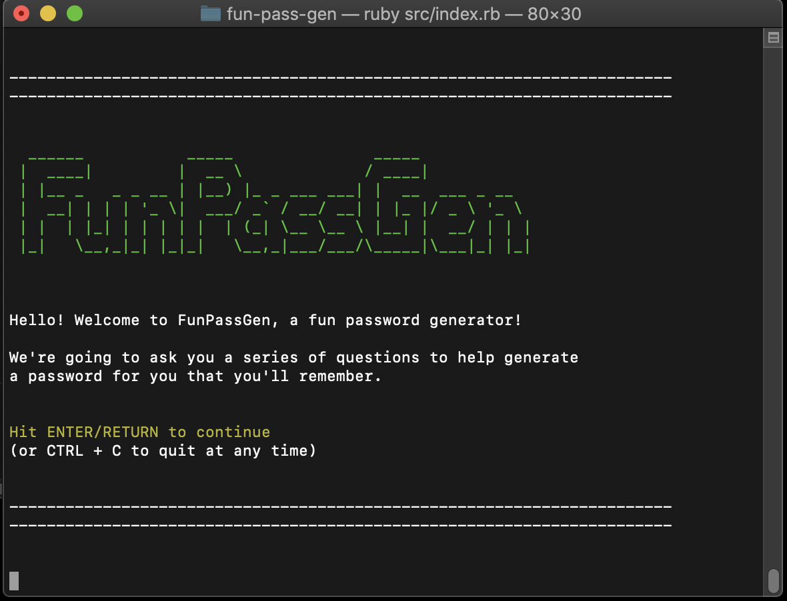
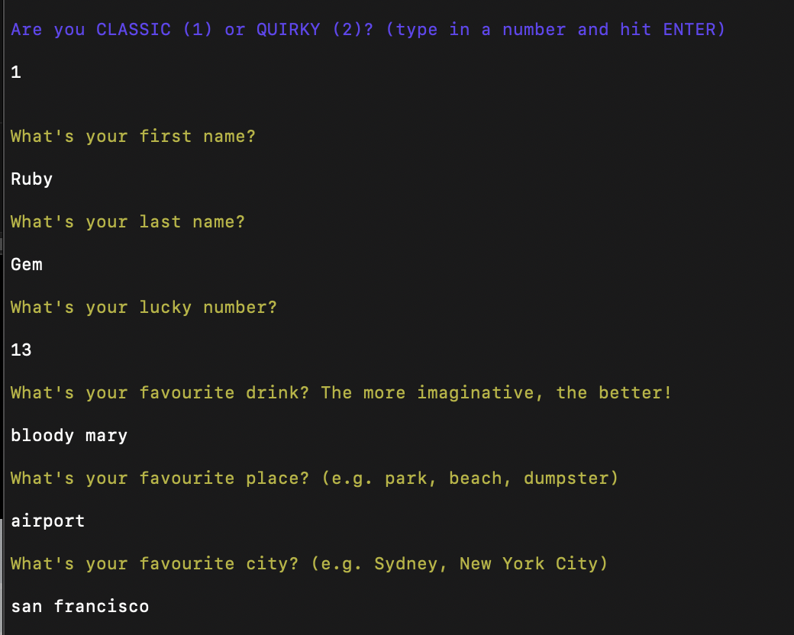
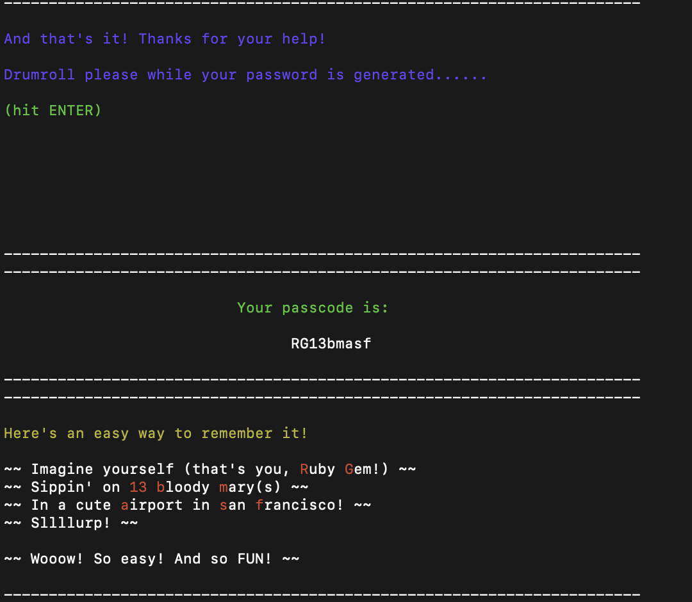

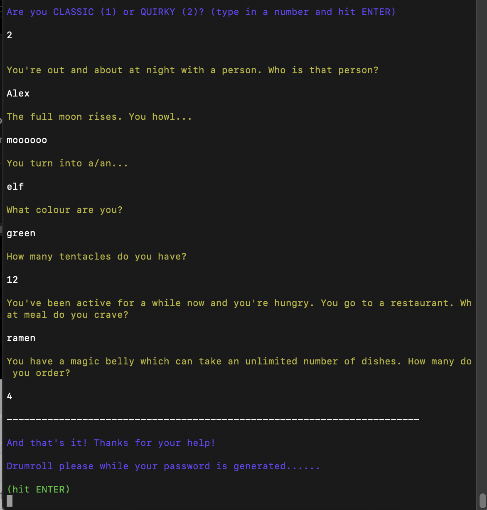
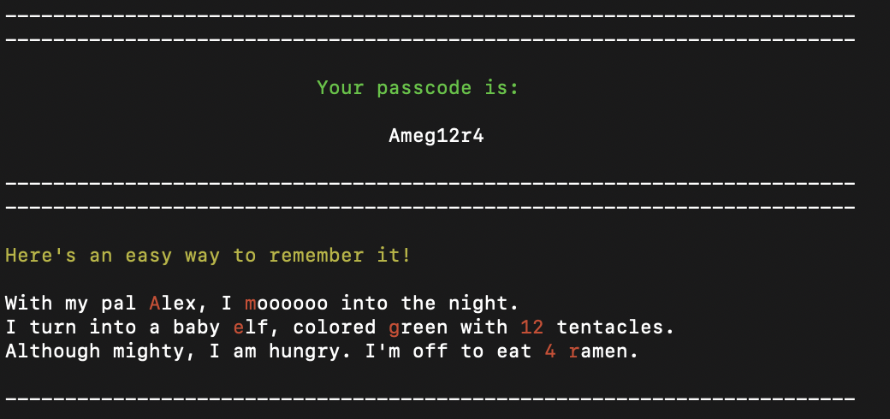

### Design & Planning ###

#### Brainstorming ####

I. Initial process

Our brainstorming process initially involved a discusion of the type of terminal app we wanted to create given the timeline we had of getting it working and fully documented in 2 days. Between creating something more novelty focused vs something functional, we decided we'd like to create something that is usable and can be potentially built on in the future.

We initially considered other ideas such as a yoga dictionary or an meal app. However, due to time constraints and the requirements for extensive databases that these will need, we decided to scrap these. After deciding on a password generator, we 
continued brainstorming in a Trello Board what the potential requirements and features we would need for the app. Examples include, potential memorable phrases and questions for the users and code conditionals to implement. Other subheadings included user stories, and a to do list that would assist us in keeping track of project requirements.

II. Trello and the Sprints

At this point we wanted to work using the agile methodology so instead of building all the structures as our initial inclination, we decided to run sprints instead. For Sprint 1, we decided on just getting the code written and getting the initial concept of the app working. Afterwards, we used Sprint 2 to expand on the scope of Sprint 1 (via adding another branch of choice for the users) finalise the questions and the minute details, along with integrating any learnings found on Sprint 1. 

#### User/Workflow Diagram ####

#### Project Plan & Timeline ####

March 4, (Monday) - We were given 2 hours to brainstorm and come up with a concept for a working terminal app that needed to be submitted on Wednesday night and presented on Thursday morning

March 5 (Tuesday) - The first day was spent fleshing out the details of the plan, listing the requirements that needed to get done, working on the structure the app via Trello where we set up a brainstorming board to add our ideas and a separate board for the first sprint that we would update as we went along. The project repo was created in github and local repositories were set up on both users's computers. A working concept of the app was successfully ran and the decision was made to create 2 paths that the user could select in the beginning that would present a different set of questions that would be used to generate their passwords. 

March 6 (Wednesday) - App is finalised and the README documentation updated. Powerpoint slides were created and discussed for the following day. Zipped project files were prepared for submission.

#### Screenshots of Trello Boards & Slack Collaboration ####

I. Brainstorming Board

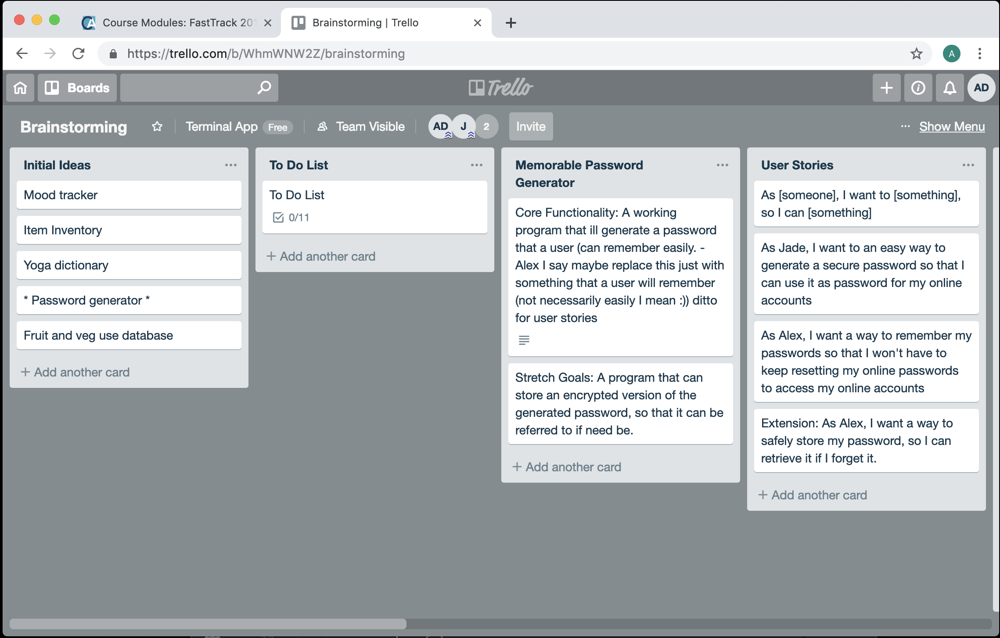

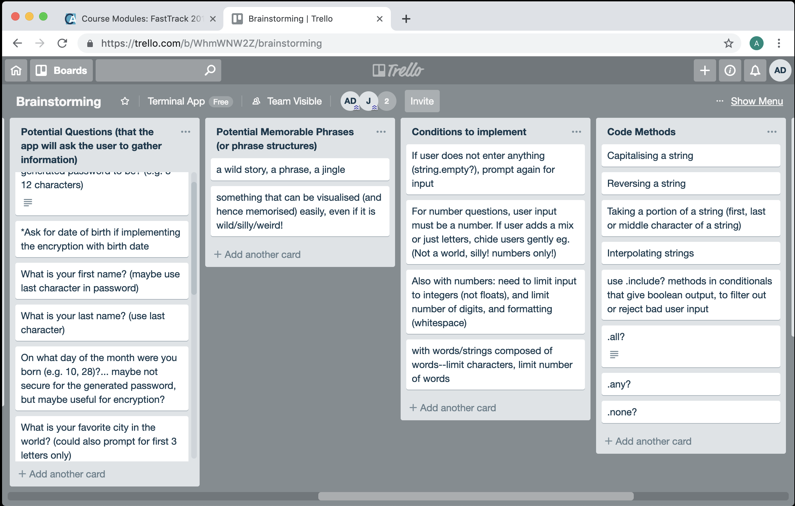

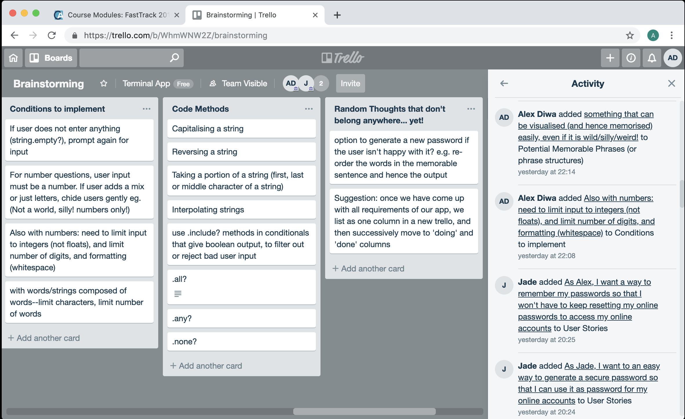

II. Sprint 1

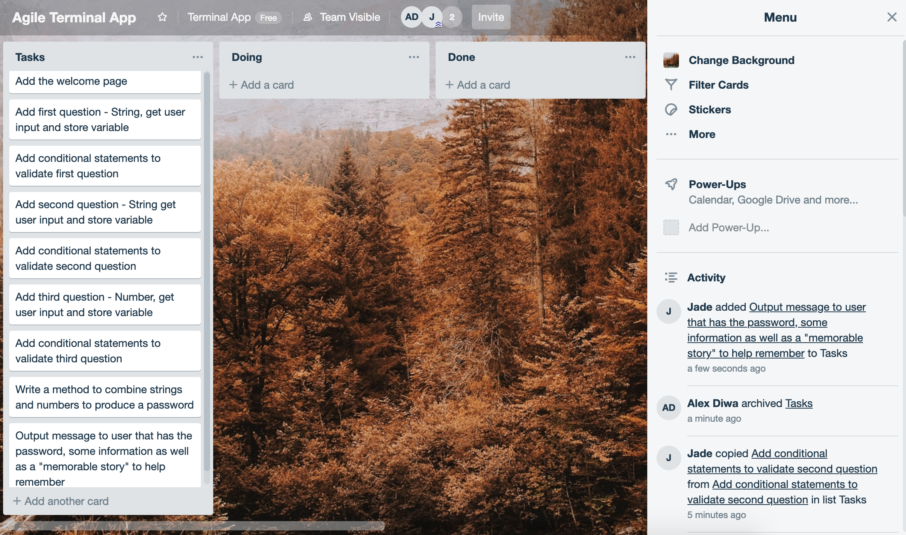

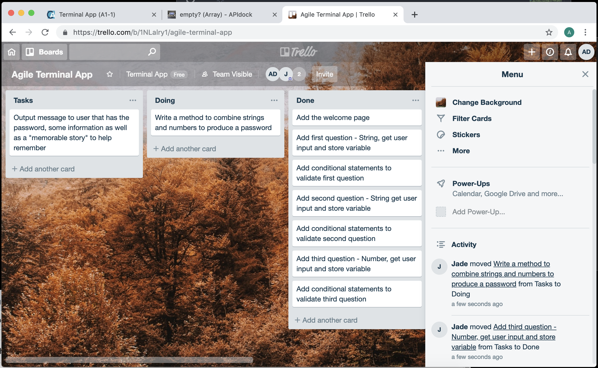

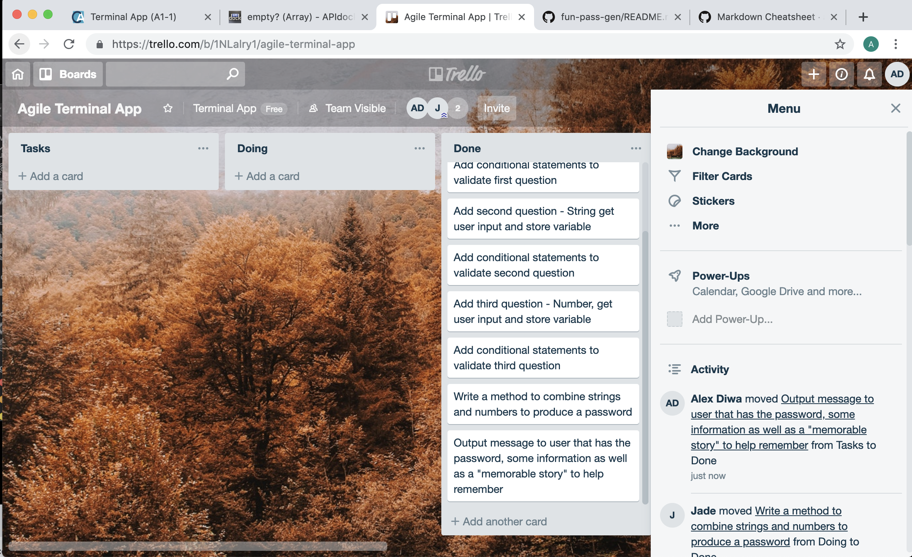

III. Sprint 2

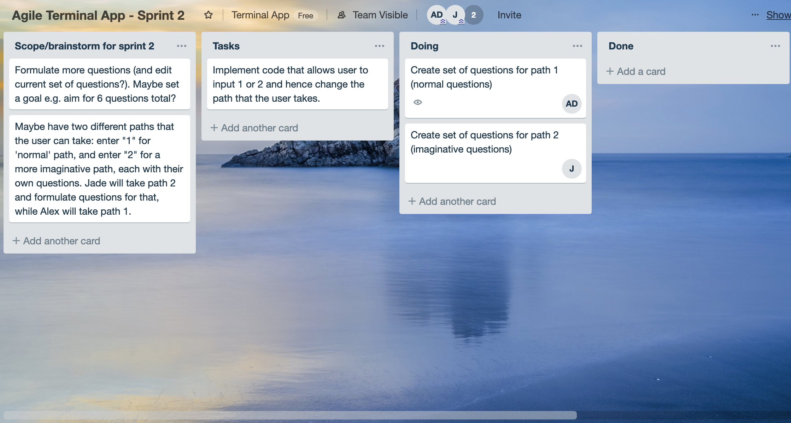

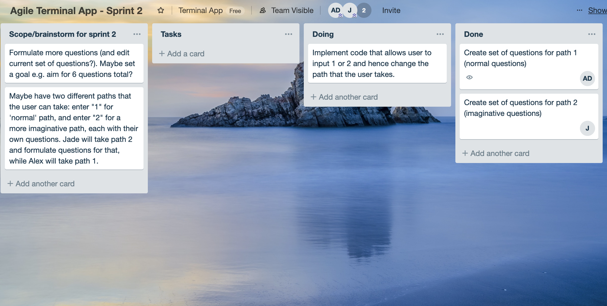

IV. Slack Communication

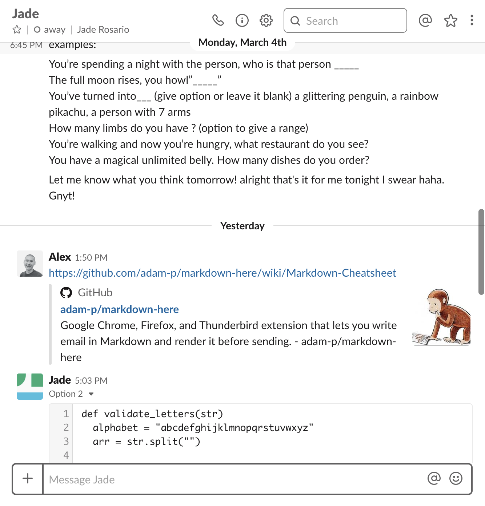

#### Higher-Level App Structure ####

We organised our app around methods that performed its key functions. Namely:
* Asking questions (ask_question)
* Generating passwords (generate_password)
* Generating a colorized output of the answers (colorize_answers)
* Encrypt password (encrypt)
* Check for valid user input string for alphabetic characters (validate_letters)
* Check for valid user input string for numeric characters (validate_numbers)

The rest of our code entered around two loops, which we used to direct the flow of the user through the app.

- Loop 1: if/else logic flow that allowed users to pick a path upon beginning the program (classic vs quirky)
- Loop 2: allowed the user to encrypt their password if they wanted to

#### Code Structure  ####
##### Our attempts to meet design specifications, and how and why things changed during development  #####

We set out to create an app that was interactive, functional and easy to use, and we believe that we accomplished this within the time frame. However, throughout this process we had to make multiple changes.

Prior to refactoring, our code was repetitive and fairly disorganised. In our first agile sprint, we had structured our code as a series of questions only with two methods for checking for valid alphabetic (validate_letters) and valid numerical strings (validate_numbers. Each question asked, prompting for user input, would repeat several lines of code calling on the validate method and loop to re-prompt if the string wasn’t valid.

We soon realised that our code had the potential to be DRYed up, so after consulting Garrett, we decided on compartmentalising our code into more methods. Specifically, we created a method ask_question, that took in both a question (string) and a method (string) as arguments. Prior to speaking with Garret, we did not know that we could call a method using a string (using ‘send’). This DRYed up our code significantly, but as we had already written a lot of code - in two separate files path1 and path2, denoting the two separate routes the user could take using the app - this involved a lot of time and refactoring. In hindsight, we should have tried to implement DRY code from the beginning, as this would have saved us a lot of time, and would have allowed us to implement more sophisticated features (e.g. text-to-speech accessibility, and cleaner and more engaging user interface). 

#### Rationale behind choosing certain data types ####

We used methods to compartmentalise chunks of code that each had their own specific purpose, while also serving to DRY up our code.

We used while loops to do direct the flow of the user throughout the program, and by allowing them to select two different routes for generating their password (normal vs creative) from the get-go. The while loops, as well as the validating methods we created, and if/elsif/else statements we implemented, allowed us to generate error messages and repeat prompting the user if their input was invalid. 

For storing the users answers, we originally had each different answer saved as separate variables (e.g. first_name). However, upon refactoring our code from repetitive questions to cleaner code that called upon the method ask_question, we were not able to establish how to write code that saved each new gets.chomp string to a different variable with each question. Hence, we decided to go for a global variable $answers, an array where the answers were stored. This meant that we had to refactor our generate_password method so that it iterated over the array, rather than simply extracting characters from different variables. 

#### Code Testing ####

We used irb test small sections of code to see if they worked. This was especially useful for the methods validate_letters and validate_numbers to ensure that the user input was correct before moving on. We needed to make sure that these methods were able to pick up on empty strings, strings such as “ “ as well as special characters and class them as invalid, so that the final password that was generated would be meaningful and as intended. We considered these inputs as edge cases—input that was unlikely if the prompts we generated were followed correctly, but that were possible for the user to input, and hence that needed to be tested. 

Screenshots of testing in irb:

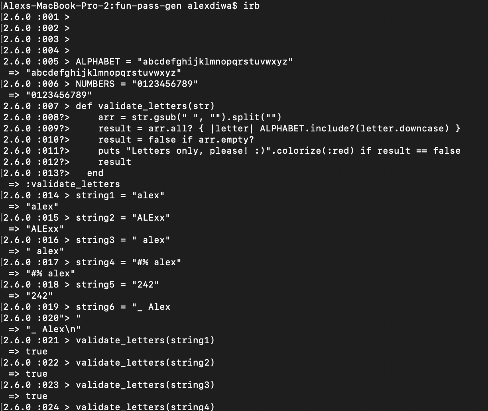

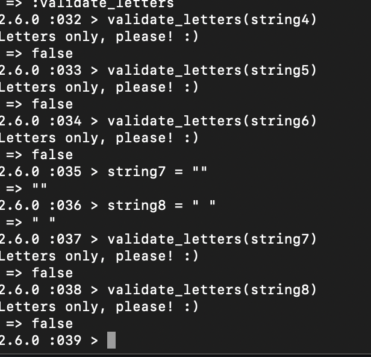

#### Societal Impact ####

We have built an app that serves a small function (generating a password) that does not touch on social, political, cultural, racial, gender or international issues. We have stayed away from introducing these issues in our created user prompts or in our memorable stories as we felt they were unnecessary for the purposes of this app. However, we acknowledge that technology has the power to have a positive impact in bringing aware to these issues, and potentially bringing about positive change. 

#### Accessibility, and potential outcomes and consequences of FunPassGen usage ####

We wanted to make our app accessible for visually-impaired users, but were limited by time constraints. In hindsight, this should have been a priority instead of considering it as a ‘sprinkle’. Specifically, we would have introduced text-to-speech capabilities, that would read out the questions for the user, any other prompts (e.g. errors) as well as the final memorable phrase/story. 

As for other considerations, our ‘Quirky’ path (option 2) originally contained phrases that we later realised might be considered ableist and offensive. This included a memorable story that involved “walking”, which may not be accessible or relatable to people who use wheelchairs, for example. We also originally had a question asking about how many limbs the user had (as their imaginary character), which if might be offensive to those who with physical disabilities.  

As we created this app, we originally had a feature for storing the password or an encrypted version of the password in a file, and also a feature for decrypting a password, either at the end of the program, or at the beginning for returning users. We later decided, however, to forego these features of storage and decryption as they might pose security risks should a person other than the intended user find those storage files and the app. Even with our current built-in features, we acknowledge that the generated password may not be as secure as we originally intended (and secure enough for distributed use), but we have implemented a framework that can be expanded on to include more questions, and potentially generate a password that was more secure.  If time allowed, we would have generated a password that also included special characters, (intentionally) determined which characters were uppercase and lowercase. These features were in the original scope of the project, but we had to forego these to focus on the main features.

We believe that our code and app does not breach any moral or ethical standards, but if this app were taken into further production, a more thorough audit would be required. 

#### Future Considerations ####

By using methods, the code can be extended and worked upon easily by developers who might want to expand upon the scope of our app. For example, the methods we have written allow for the implementation of different questions and narratives altogether, e.g., by simply calling upon ask_question with different strings, hence adding different data to the global answers array. 

There is certainly scope for improvement, however. Specifically, we could have written a method that generated the memorable user story after the answers had been fused into a password (e.g. after the generate_password method had been called). This would allow for nicer and cleaner code that avoided using string concatenation, which makes it more cumbersome (although doable) for future developers to modify the memorable story.  If time allowed, we would refactor this code even further to allow developers to write a memorable narrative with ease, irrespective of the questions asked. 
